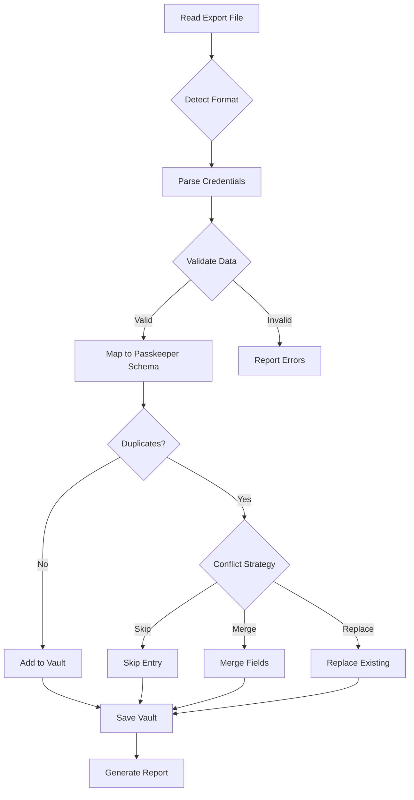

## Description

Implement import functionality to migrate user data from popular password managers including 1Password, LastPass, Bitwarden, KeePass, and others.

## Motivation

Users switching from other password managers need an easy migration path. Manual re-entry of hundreds of credentials is time-consuming and error-prone. Import support significantly lowers the barrier to adoption.

## Proposed Solution

### Supported Formats

1. **1Password**
   - 1PIF (1Password Interchange Format)
   - CSV export

2. **LastPass**
   - CSV export format

3. **Bitwarden**
   - JSON export
   - CSV export

4. **KeePass**
   - XML export (KeePass 2.x)
   - CSV export

5. **Chrome/Firefox**
   - Browser CSV export

6. **Generic**
   - Standard CSV format (title, username, password, url, notes)

### CLI Command

```bash
# Import from file with auto-detection
passkeeper import --file export.csv --vault my-vault.vault

# Specify format explicitly
passkeeper import --file export.1pif --format 1password --vault my-vault.vault

# Dry run (preview without importing)
passkeeper import --file export.csv --vault my-vault.vault --dry-run

# Import with conflict resolution
passkeeper import --file export.csv --vault my-vault.vault --on-conflict [skip|merge|replace]
```

### Format Detection

```rust
enum ImportFormat {
    OnePassword,      // .1pif
    LastPass,         // CSV with specific columns
    Bitwarden,        // JSON with specific schema
    KeePass,          // XML
    ChromeBrowser,    // CSV from Chrome
    FirefoxBrowser,   // CSV from Firefox
    GenericCsv,       // Fallback
}

// Auto-detect based on file extension and content
fn detect_format(path: &Path, content: &str) -> Result<ImportFormat>
```

### Import Process



### Data Mapping

| Source Manager | Title | Username | Password | URL | Notes | Tags | TOTP |
|----------------|-------|----------|----------|-----|-------|------|------|
| 1Password      | ✅    | ✅       | ✅       | ✅  | ✅    | ✅   | ✅   |
| LastPass       | ✅    | ✅       | ✅       | ✅  | ✅    | ✅   | ❌   |
| Bitwarden      | ✅    | ✅       | ✅       | ✅  | ✅    | ✅   | ✅   |
| KeePass        | ✅    | ✅       | ✅       | ✅  | ✅    | ✅   | ✅   |
| Chrome         | ✅    | ✅       | ✅       | ✅  | ❌    | ❌   | ❌   |
| Firefox        | ✅    | ✅       | ✅       | ✅  | ❌    | ❌   | ❌   |

## Implementation Plan

### Phase 1: Core Import Infrastructure
- [ ] Create `ImportFormat` enum
- [ ] Implement format detection
- [ ] Create `ImportedCredential` intermediate struct
- [ ] Add validation logic
- [ ] Implement conflict resolution strategies

### Phase 2: Format Parsers
- [ ] CSV parser (generic)
- [ ] 1Password (.1pif parser)
- [ ] LastPass CSV parser
- [ ] Bitwarden JSON parser
- [ ] KeePass XML parser
- [ ] Chrome CSV parser
- [ ] Firefox CSV parser

### Phase 3: CLI Integration
- [ ] Add `import` command
- [ ] Add format option (`--format`)
- [ ] Add dry-run mode
- [ ] Add conflict resolution option
- [ ] Implement progress reporting
- [ ] Generate import summary report

### Phase 4: Testing & Documentation
- [ ] Create sample export files for each format
- [ ] Unit tests for each parser
- [ ] Integration tests with test vaults
- [ ] User documentation with examples
- [ ] Migration guide from each manager

## Example Import Report

```
Import Summary
==============
Source: lastpass_export.csv
Format: LastPass CSV
Vault: my-vault.vault

Results:
  ✅ Successfully imported: 247 credentials
  ⚠️  Skipped (duplicates):  12 credentials
  ❌ Failed (invalid data): 3 credentials

Details:
  - Work accounts:     84 imported
  - Personal:          93 imported
  - Banking:           45 imported
  - Social Media:      25 imported

Warnings:
  ⚠️  3 entries missing URLs
  ⚠️  12 weak passwords detected (run 'passkeeper audit' to review)

Failed Entries:
  ❌ Line 156: Missing required field 'password'
  ❌ Line 203: Invalid URL format
  ❌ Line 417: Duplicate title with no username to differentiate

Next Steps:
  1. Review failed entries in: import_errors.log
  2. Run security audit: passkeeper audit --vault my-vault.vault
  3. Update weak passwords identified in audit
```

## Security Considerations

- 🔒 **Export Files**: Warn users that export files contain plaintext passwords
- 🗑️ **Cleanup**: Recommend securely deleting export files after import
- 🔍 **Validation**: Sanitize all imported data
- 🚨 **Warnings**: Alert on suspicious patterns (very weak passwords, empty fields)
- 📝 **Logging**: Log import activity for audit trail

### Security Warnings

```
WARNING: Export files contain your passwords in plaintext!

Security recommendations:
  1. Store export file in encrypted folder only
  2. Delete export file securely after import
  3. Never send export files over email/chat
  4. Verify import was successful before deleting from source
```

## Dependencies

```toml
# Add to Cargo.toml
[dependencies]
csv = "1.3"              # CSV parsing
serde_json = "1.0"       # JSON parsing
quick-xml = "0.31"       # XML parsing for KeePass
encoding_rs = "0.8"      # Handle different text encodings
```

## Alternatives Considered

1. **Manual Migration**: Too tedious for users
2. **Web-based Converter**: Security risk (uploads plaintext passwords)
3. **API Integration**: Most managers don't offer import APIs

## Additional Context

### Export Instructions for Users

**1Password**:
1. Open 1Password
2. File → Export → All Items
3. Format: 1Password Interchange Format (.1pif) or CSV

**LastPass**:
1. Open LastPass Vault
2. Advanced Options → Export
3. Save as CSV

**Bitwarden**:
1. Vault → Tools → Export Vault
2. Format: JSON or CSV

**KeePass**:
1. File → Export
2. Format: KeePass XML (2.x)

**Chrome**:
1. Settings → Passwords → Export passwords
2. Save as CSV

**Firefox**:
1. about:logins → ⋮ → Export Logins
2. Save as CSV

## Acceptance Criteria

- [ ] Successfully imports from all 6 major sources
- [ ] Correctly maps all fields
- [ ] Handles duplicates gracefully
- [ ] Validates imported data
- [ ] Generates detailed import report
- [ ] Warns about security concerns
- [ ] Handles errors without corrupting vault
- [ ] Documentation with examples for each format
- [ ] Test suite with sample exports

## Resources

- [1Password Export Format](https://support.1password.com/export/)
- [LastPass Export Guide](https://support.lastpass.com/help/how-do-i-export-stored-data-from-lastpass)
- [Bitwarden Export](https://bitwarden.com/help/export-your-data/)
- [KeePass XML Format](https://keepass.info/help/kb/xml_replace.html)

---

**Labels**: `enhancement`, `import`, `migration`, `high-priority`
**Estimated Effort**: 3-4 weeks
**Difficulty**: Medium
